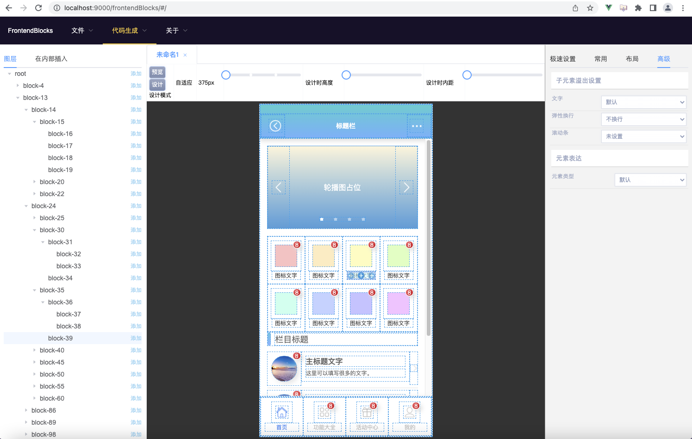
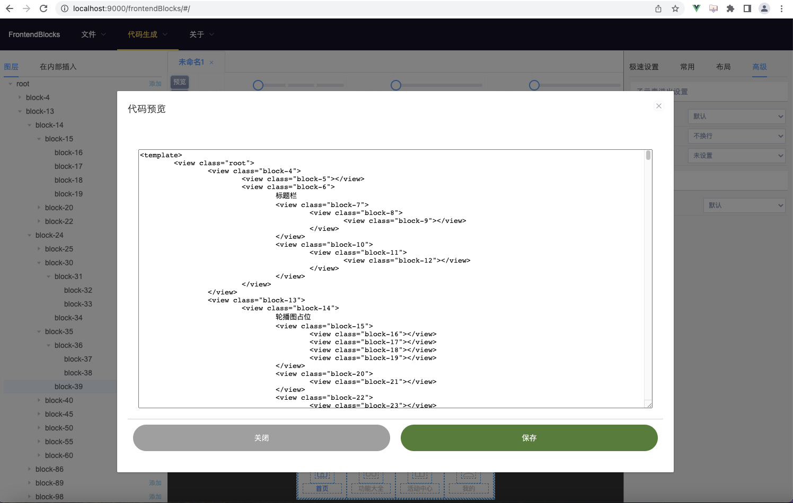
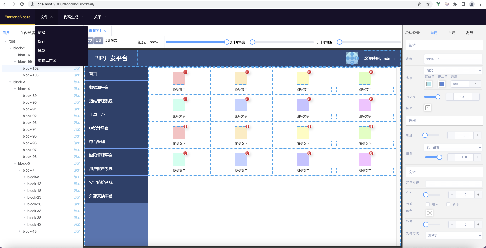
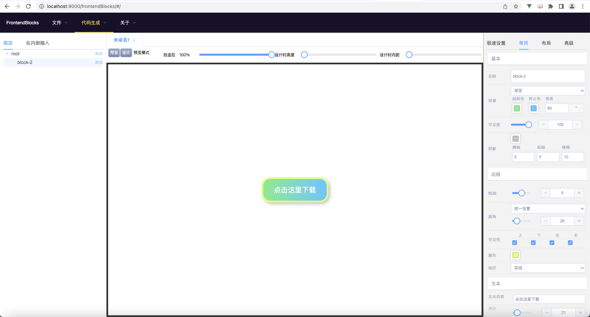

# FrontendBlocks

#### 介绍 Introduce
本软件是一款强大的所见即所得前端页面设计器，是低代码开发领域的基础建设，生成的代码不依赖于任何框架，实测可以将前端布局工作的耗时减少80%以上，最关键的是，它实现了人人都可以写前端页面的梦想。  
不用写一行代码即可让设计师、前端开发人员轻松设计出前端代码的利器，100%还原设计稿不再是梦。对于Uniapp开发非常友好，可以快速生成组件和页面。  
本软件可以生成HTML5代码、按2x生成手机端VUE代码、按1x生成电脑端VUE代码，也可以直接生成JSON串，供其他开发工具（包括自主研发的）进行二次加工。  
本软件采用Apache 2.0协议开源，可以免费商用。如有任何问题欢迎反馈，让我们共同建设好该开源项目。突出代码贡献者将会把名字写入README.md中，欢迎贡献。
This software is a powerful WYSIWYG front-end page designer, which is the basic construction in the field of low code development. The generated code does not depend on any framework. The actual measurement can reduce the time consumption of front-end layout work by more than 80%. The most important thing is that it realizes the dream that everyone can write front-end pages.
Designers and front-end developers can easily design front-end code without writing a line of code. It is no longer a dream to 100% restore the design draft. It is very friendly to uniapp development and can generate components and pages quickly.
This software can generate HTML5 code, generate mobile phone Vue code by 2x, generate computer Vue code by 1X, or directly generate JSON string for secondary processing by other development tools (including self-developed).
This software is open source with Apache 2.0 licence and can be used for free in business. If you have any questions, please feedback. Let's build this open source project together. Outstanding code contributors will write their names in readme.md, welcome to contribute.

在线演示地址：
Online presentation address:
http://39.104.17.92/frontendBlocks/

#### 软件架构 Architecture
使用VUE2.0开发，开箱即用。所生成的代码采用Flex布局和流式布局，具备良好的自适应性，特殊需求下也可以支持绝对定位布局、固钉布局。  
对于Uniapp移动端开发者而言，可以直接生成rpx单位的样式。  
对于图片，建议自建图床进行维护，如果有图片素材希望随着设计稿而维护，可以上网搜索“图片转BASE64编码”，把编码当做图片地址粘过去也是一样的（生成的文件会较大）。  
Developed with vue2.0, ready to use. The generated code adopts flex layout and streaming layout with adaptability. Sometimes in your project, it can also support absolute positioning layout and fixed layout.
For uniapp mobile developers, rpx unit can be directly generated instead of px.
For pictures, it's recommended to build a picture cloud server. If you need picture embed in your design file, you can search the Internet for "picture to Base64 code", and paste the code as the picture address (the generated file will be large).

#### 安装教程 How to Install

1.  npm install  
2.  npm run serve  
3.  用浏览器打开(Open this url in Chrome) http://localhost:9000/frontendBlocks/

#### 独立部署教程 How to Deploy
1.  npm run build
2.  把dist目录中的文件拷贝到服务器上，部署目录为frontendBlocks即可(copy files in 'dist' directory to your sever, deploy in apache/nginx and folder called 'frontendBlocks')

#### 使用说明 How to Use

1.  左侧图层面板可以点击“添加”按钮添加子元素
2.  设计时高度和设计时内距用来方便观察父子元素之间的关系，
3.  左侧面板的“在内部插入”功能是来源于public下的tools.json，其中填写的blocks节点源于“代码生成”菜单下的“生成可二次加工的JSON串”
4.  中间面板可以调整自适应宽度，如果是设计手机端，建议使用375px
5.  右侧面板当点选某个块时可以调整其属性，高级面板里可以设置元素类型的表达，支持表达成input
6.  文件可以新建、保存、读取，可以跨页签复制粘贴（复用设计稿的利器）
7.  当前的设计会被自动保存，待下次打开时可继续上次的设计稿继续设计，非常的人性化
8.  点击块上的小加号，可以很方便的追加新的块

1. On the left layer panel, click "add" to add sub element in target
2. The design-time height and the design-time internal distance are used to facilitate the observation of the relationship between parent and child elements,
3. The "InsertInto" tab of the left panel is derived from 'public/tools.json', where the filled blocks node is from the "generate reusable JSON string" under the "code generation" menu
4. The middle panel can adjust the adaptive width. If the mobile phone is designed, it is recommended to use 375px
5. On the right panel, when a block is selected, its attributes can be adjusted. In the advanced panel, the type of element can be set, and supported generate as 'input'
6. Your frontend design can be created, saved and read, and can be copied and pasted across tabs (very useful for reusing design drafts)
7. The current design will be automatically saved. When you open in browser at next time, you can continue the design of the previous design draft. It is user-friendly.
8. Click the small plus button on the block to easily add a new block
(English version needs someone to contribute i18n module or function)

#### 疑难解答 Troubleshoot
1.  为什么我不能撤销？  
与传统设计软件不同，本软件产生的是实实在在的代码，因此增加撤销功能会增加前端运行时压力，考虑再三，决定不设计撤销功能。
2.  布局用不明白怎么办？  
建议使用者先了解一下Flex布局。如果没有Flex布局基础可以先从这几步开始：设置父容器的“子元素排列”->设置子元素的宽度和高度->如果子元素的宽度和高度是百分比，则需要设置父容器的宽度和高度->给子元素设置一些可视化的效果，比如背景颜色、文本内容等等
3.  元素排列太紧密了，点不上怎么办？  
可以把“设计时高度”和“设计时内距”拉大一点点，这样就能看到元素了，这两个设置不会影响输出效果。而且强烈建议在左侧“图层”面板中进行元素的点选，这样会更加精确
4.  为什么我设置了宽度或高度但实际上不是按我设置的值显示？而且为什么当我添加元素多起来的时候，所有元素都挤在一起了？  
这是因为Flex布局下元素呈弹性效果，如果要保持一个元素固定宽度或高度，另一个元素自适应，请在固定宽高的元素上勾选“布局”->“弹性”->“钢化”。如果要实现一个可滚动的列表区，请将父元素勾选“布局”->“弹性”->“关闭弹性”
5.  有的元素里面子元素过多，导致页面出现滚动条或者影响了其他元素的布局怎么办？  
可以尝试设置“高级”->“子元素溢出设置”->“滚动条”，只要不是“未设置”，都会触发BFC机制，成为独立渲染区域，这样就不会出现溢出或影响其他元素布局的情况了。
6.  我的设计稿崩溃导致FrontendBlocks打不开，怎么办？  
尽管我极力避免软件出现崩溃，但事实上软件操作环境复杂，可能出现无法预料的BUG。可以按下F12，在应用（Application）->存储（Storage）->本地存储空间（Local Storage）中，把tempSave删掉，重新刷新界面即可。如果不涉密的话，可以将tempSave中的值复制出来提一个Issue，社区会尽快解决这个BUG。

1. Why can't I undo it?
Unlike traditional design software, this software produces real code in memory, so adding undo will increase the pressure on front-end runtime. 
2. What can I do with the layout?
It is recommended that users first understand the Flex layout. If you don't have a Flex layout knowledge, you can start with these steps: Set the "child element arrangement" of the parent container - > Set the width and height of the child element - > If the width and height of the child element are a percentage, you need to set the width and height of the parent container - > Set some visual effects for the child element, such as background color, text content, and so on.
3. The elements are so tightly arranged that cannot click accurately?
You can increase the Design-Time Height and Design-Time Interval a little so that you can see the elements, which do not affect the output. It is also strongly recommended that elements be selected in the Layers panel on the left for more precision
4. Why did I set the width or height but not actually display it at the value I set? And why are all the elements crowded together when I add more?
This is because elements under the Flex layout have an elastic effect. To keep one element fixed width or height and the other element adaptive, check Layout -> Elasticity -> Tempering on elements with fixed width and height. To achieve a scrollable list area, check the parent element Layout -> Elasticity -> Turn Elasticity off
5. What if there are too many sub-elements in some elements that cause scrollbars on the page or affect the layout of other elements?
You can try setting Advanced-> Subelement Overflow Settings-> Scrollbar, which triggers the BFC mechanism to become a stand-alone rendering area as long as it is not Set-Up, so that no overflow or impact on the layout of other elements will occur.
6. What can I do when my design crash prevents FrontendBlocks from opening?
Despite my best efforts to avoid software crashes, the reality is that the software is operating in a complex environment with unexpected BUGs. You can press F12 to delete tempSave and refresh the interface in Application->Storage->Local Storage. If not, you can copy the values in tempSave to raise a question and the community will resolve the BUG as soon as possible.

#### 二次开发说明 Secondary Development
1.  “在内部插入”功能的扩展是在public/tools.json中完成，手动编写可以参照第4条。
2.  想要增加新的属性，可以修改src/components/layout/PropertiesPanel.vue文件，data里的defaultForm是默认值，每一次更新都会用它来初始化，当前编辑的元素样式都会存在在propForm对象里。fromBlock方法会将选中元素的样式进行解析，回显到界面上。而toBlock方法则会将填写好的属性赋予给选中元素，使之生效。（如果你需要和业务系统相结合，可以在这里加点东西，比如接口地址、数据来源之类的）
3.  生成代码的功能都放在了src/components/layout/ToolsBar.vue里，想生成其他语言的（比如Android的XML、React、甚至Winform，可以根据逻辑自行实现）
4.  每一个元素所对应的Object里，properties代表了附加属性，id代表全局唯一编码，style代表该元素的样式，blocks代表该元素的子元素集合，domType是元素的类型（默认是div，即使表达成view也是写成div），text是指元素内部的文字
5.  上下文在src/components/layout/WorkSpace.vue里，它是充血的，可以扩展方法，而且几乎在整个项目的任何地方都能找到它的引用，其中的createNewBlock定义了创建一个新元素的初始属性。
6.  总的来说，实现逻辑就是：模板创建->用户自定义属性->上下文连锁更新->Block.vue预览表达->ToolsBar.vue生成代码->CodePreview.vue预览并下载代码

1. The extension of the "insert inside" function is completed in public/tools.json. Please refer to Article 4 for manual writing.
2. To add new properties, you can modify src/components/layout/PropertiesPanel.vue file, the defaultform in the data is the default value. It will be used to initialize each update. The currently edited element style will exist in the propform object. The fromblock method will parse the style of the selected element and echo it to the interface. The toblock method will assign the filled attributes to the selected element to make it effective. (if you need to integrate with the business system, you can add something here, such as interface address, data source, etc.)
3. The function of generating code is placed in src/components/layout/ToolsBar.vue, you want to generate other languages (such as Android XML, react, and even WinForm, which can be implemented according to logic)
4. In the object corresponding to each element, properties represents the additional attribute, ID represents the globally unique code, style represents the style of the element, blocks represents the collection of sub elements of the element, domtype is the type of the element (default is div, even if expressed as view, it is also written as DIV), and text refers to the text inside the element
5. The context is in src/components/layout/WorkSpace.vue, it is congested and can be extended. Its reference can be found almost anywhere in the whole project. The createnewblock defines the initial attribute of creating a new element.
6. In general, the implementation logic is: template creation - > user-defined attributes - > context chain update - > block.vue preview expression - > toolbar.vue generate code - > codepreview.vue preview and download code

#### 快捷键 Shortcut Keys
1.  Ctrl+C 复制选中的块 Copy selected block
2.  Ctrl+V 在所选中块的内部进行追加粘贴 Paste copied block in selected block
3.  Delete 删除选中的块 Delete selected block

#### 参与贡献 Contributors

1.  黑龙江省瑜美科技发展有限公司 杨若瑜 2020年 创建 1.0  
    Heilongjiang Yumeisoft Co., Ltd  Ruoyu Yang in 2020 ver 1.0

#### 其他 Other

1.  我的博客：yangruoyu.blog.csdn.net  
    My Blog: yangruoyu.blog.csdn.net
